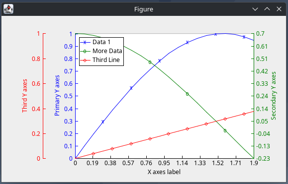

# JMPlot
A 2D line plot library for AWT/Swing GUI, inspired by GNU Octave and legacy 
MATLAB look and feel and syntax.

This was developed for the use in the RBMK simulator project and adapted to this 
purpose. While aiming to use similar function names for convenience, it lacks 
major in-detail functionalities and has some other functions that are not 
present in the original plot.

The package can be used in two ways. Either it can be implemented in AWT or 
Swing GUI or, using the VisualizeData static classes, a plot command can be 
placed anywhere and will behave like it does in traditional beginners .m 
script files. This provides some kind of poor man's debugging.